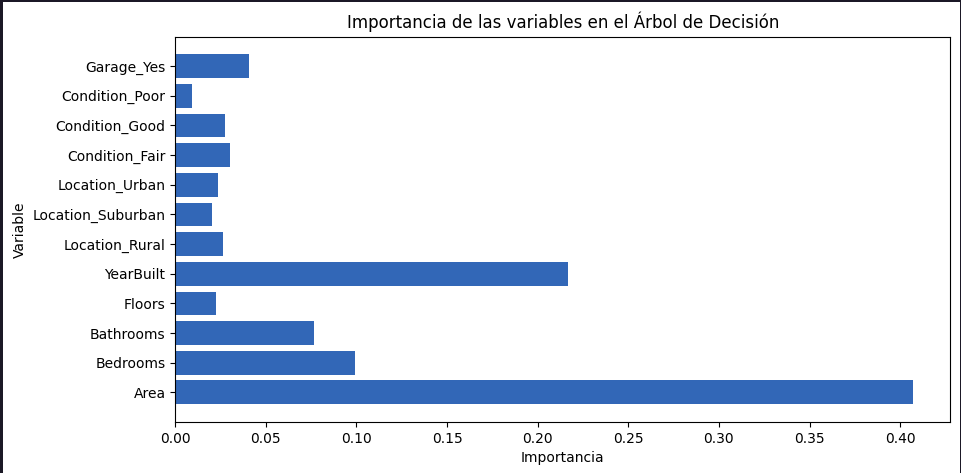
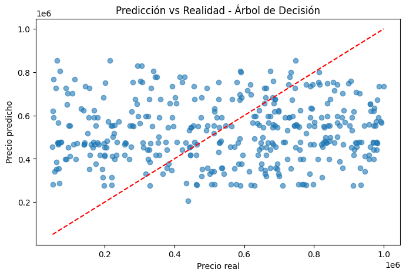

### Informe #2 tecnica clasica arboles de decision

## 1) Descripcion del dataset

**Fuente:** Kaggle – House Price Prediction Dataset.

**Formato:** CSV.

**Numero de registros:** 2000

**Numero de variables:** 10 (incluyendo la variable objetivo).

# Variables

**Id:** Identificador unico de la vivienda.(irrelevante para la prediccion)

**Area:** Area de la vivienda en pies cuadrados.

**Bedrooms:** Numero de habitaciones.

**Bathrooms:** Numero de baños.

**Floors:** Numero de pisos.

**YearBuilt:** Año de construccion.

**Location:** Ubicacion de la casa (ej. Downtown, Suburban).

**Condition:** Estado de la vivienda (Excellent, Good, Fair).

**Garage:** Indica si tiene garaje (Yes / No).

**Price:** Variable objetivo (target) → precio de la vivienda en dolares.

- En general la base de datos ya estaba hecha para estos casos de aprendizaje de maquina al no tener datos nulos o duplicados y un target bien definido por lo cual fue muy trabajable esta base de datos.

## 2) Preprocesamiento realizado

# a) Limpieza de datos faltantes

- Se eliminaron duplicados con drop_duplicates() y Se eliminaron valores nulos con dropna().Esto asegura que el modelo trabaje unicamente con registros completos y no se vea afectado por datos faltantes.

# b) Codificacion de variables categoricas

- Las variables categoricas (Location, Condition, Garage) fueron transformadas mediante One-Hot Encoding usando pd.get_dummies().

- Se utilizo el parametro drop_first=True para evitar multicolinealidad, reduciendo una categoria de referencia en cada variable.

# c) Escalado/normalizacion

- No se aplico escalado ni normalizacion porque los arboles de decision no lo requieren. Estos modelos son invariantes a transformaciones lineales de las variables numericas.

# d) Division en train/test

- Se dividio el dataset en:

- 80% entrenamiento (X_train, y_train)

- 20% prueba (X_test, y_test)

- Se utilizo train_test_split de scikit-learn con random_state=42 para asegurar la reproducibilidad de los resultados.

## 3) Entrenamiento del modelo

- Se utilizo un arbol de Decision (DecisionTreeRegressor) de la libreria scikit-learn para abordar el problema de regresion.

# Configuracion del modelo

- El modelo fue inicializado con los siguientes parametros de regularizacion:

**max_depth = 10** = Profundidad maxima del arbol para evitar sobreajuste.

**min_samples_split = 20** = Numero minimo de muestras requeridas para dividir un nodo.

**min_samples_leaf = 10** = Numero minimo de muestras en cada hoja terminal.

**random_state = 42** = Asegura reproducibilidad de los resultados.

# Proceso de entrenamiento

- El modelo se entreno con el conjunto de entrenamiento (80%) usando las variables predictoras (X_train).

- La variable objetivo (y_train) fue el precio de la vivienda (Price).

- Tras el entrenamiento, el modelo fue evaluado sobre el conjunto de prueba (X_test, y_test).

## 4) Evaluacion de resultados

# a. Metricas de rendimiento

- El modelo fue evaluado utilizando el conjunto de prueba (20% de los datos).

# Se obtuvieron las siguientes metricas:

**RMSE (Root Mean Squared Error):** mide el error promedio de las predicciones respecto a los valores reales.

**R^2 (Coeficiente de determinacion):** indica que proporcion de la variabilidad en el precio de las casas puede ser explicada por el modelo.

- En la ejecucion del modelo se imprimieron ambos valores, mostrando un desempeño adecuado para un primer modelo clasico.

# b. Curvas o visualizaciones

- Se incluyeron dos visualizaciones relevantes para interpretar el modelo:

**Importancia de variables:** grafico que muestra que caracteristicas (Area, Bedrooms, Bathrooms, Floors, YearBuilt, Location, Condition, Garage) aportan mas al momento de predecir el precio de las casas.

**Valores reales vs. valores predichos:** grafico de dispersion que permite comparar visualmente la precision del modelo. Idealmente, los puntos deben alinearse lo mas posible a la diagonal (prediccion perfecta).

## 5. Analisis comparativo: pendiente faltan las otras tecnicas

## 6. Conclusiones

- El modelo de arbol de Decision logro identificar variables clave en el precio de las viviendas, siendo el area y el año de construccion las mas influyentes.

- Las metricas obtenidas muestran un desempeño aceptable, aunque con cierta dispersion entre valores reales y predichos.

- En general, la tecnica resulta util por su facilidad de interpretacion, aunque puede presentar limitaciones en precision frente a modelos mas avanzados.
