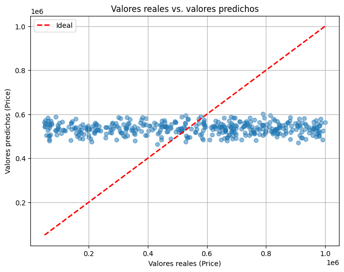

### Informe #1 técnica clásica: Regresión Lineal

## 1) Descripción del dataset

**Fuente:** Kaggle – House Price Prediction Dataset.  

**Formato:** CSV.  

**Número de registros:** 2000  

**Número de variables:** 10 (incluyendo la variable objetivo).  

### Variables

- **Id:** Identificador único de la vivienda (irrelevante para la predicción).  
- **Area:** Área de la vivienda en pies cuadrados.  
- **Bedrooms:** Número de habitaciones.  
- **Bathrooms:** Número de baños.  
- **Floors:** Número de pisos.  
- **YearBuilt:** Año de construcción.  
- **Location:** Ubicación de la casa (ej. Downtown, Suburban).  
- **Condition:** Estado de la vivienda (Excellent, Good, Fair).  
- **Garage:** Indica si tiene garaje (Yes / No).  
- **Price:** Variable objetivo (target) → precio de la vivienda en dólares.  

👉 La base de datos es limpia (sin valores nulos ni duplicados) y con un target bien definido, lo que la hace adecuada para problemas de predicción de precios de casas.

---

## 2) Preprocesamiento realizado

### a) Limpieza de datos
- Se eliminaron valores nulos con `dropna()`.  
- Se eliminó la columna **Id**, al no aportar información predictiva.  

### b) Codificación de variables categóricas
- Se aplicó **One-Hot Encoding** con `pd.get_dummies()` para transformar variables categóricas (`Location`, `Condition`, `Garage`).  
- Se utilizó `drop_first=True` para evitar multicolinealidad.  

### c) Escalado / normalización
- Se aplicó **MinMaxScaler** a las variables numéricas (`Area`, `Bedrooms`, `Bathrooms`, `Floors`, `YearBuilt`) para normalizarlas entre 0 y 1.  
- Aunque la regresión lineal no requiere normalización, se utilizó para mantener consistencia entre variables.  

### d) División en train/test
- Se dividió el dataset en:  
  - **80% entrenamiento (X_train, y_train)**  
  - **20% prueba (X_test, y_test)**  
- La división se realizó con `train_test_split` y `random_state=42` para asegurar reproducibilidad.  

---

## 3) Entrenamiento del modelo

- Se utilizó la clase **LinearRegression** de `scikit-learn`.  
- Proceso de entrenamiento:  
  - El modelo se entrenó con las variables predictoras (X_train).  
  - La variable objetivo (y_train) fue el **Price**.  
  - Posteriormente se realizaron predicciones sobre el conjunto de prueba (X_test).  

---

## 4) Evaluación de resultados

### a. Métricas de rendimiento
El modelo fue evaluado con las métricas clásicas para regresión:  

- **MSE (Mean Squared Error):** mide el error cuadrático medio de las predicciones respecto a los valores reales.  
- **R² (Coeficiente de determinación):** indica qué proporción de la variabilidad en el precio puede ser explicada por el modelo.  

**Resultados obtenidos en test:**  
- MSE: `78,321,466,146.03`  
- R²: `-0.0067`  

Interpretación:  
- El **MSE elevado** refleja un error grande en las predicciones debido a la escala de la variable objetivo (precios en cientos de miles).  
- El **R² negativo** indica que el modelo predice peor que un modelo base que siempre devuelve el valor promedio del precio.  

### b. Visualización Real vs Predicho
Se generó un gráfico de dispersión **Valores reales vs. valores predichos**, donde los puntos deberían alinearse a la diagonal en caso de un buen ajuste.  
En este caso, la dispersión confirma que la regresión lineal no logra capturar adecuadamente la relación entre las variables y el precio.  

---

## 5) Análisis comparativo
Pendiente: este modelo será comparado con otras técnicas más avanzadas para evaluar mejoras en el rendimiento.  

---

## 6) Conclusiones

- La **regresión lineal** no resultó adecuada para este dataset, dado que la relación entre las variables y el precio **no es estrictamente lineal**.  
- Las métricas obtenidas muestran que el modelo se desempeña incluso peor que una predicción simple de la media del target.  
- A pesar de ello, este resultado es valioso dentro del análisis comparativo, ya que establece una **línea base clásica** contra la cual se pueden medir otros modelos más complejos.  
